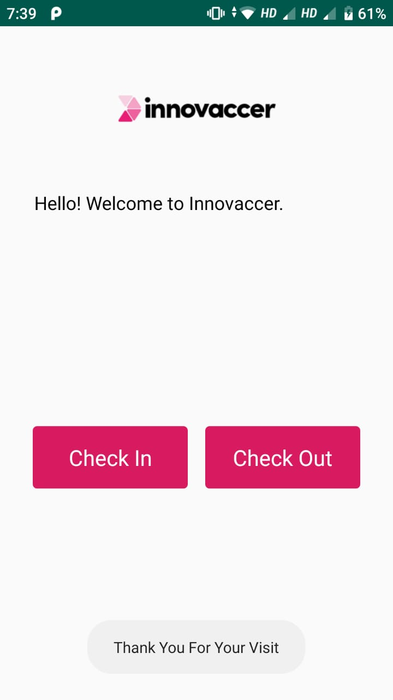
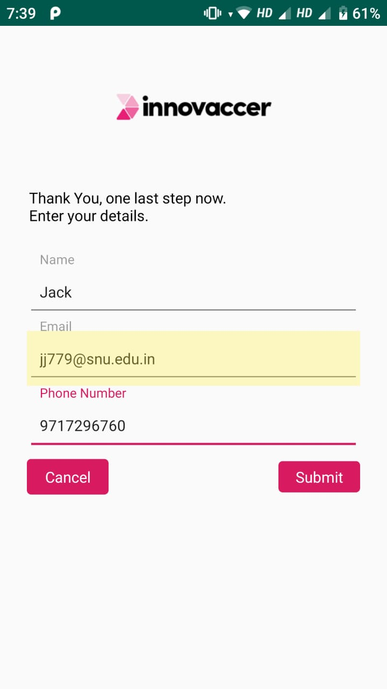
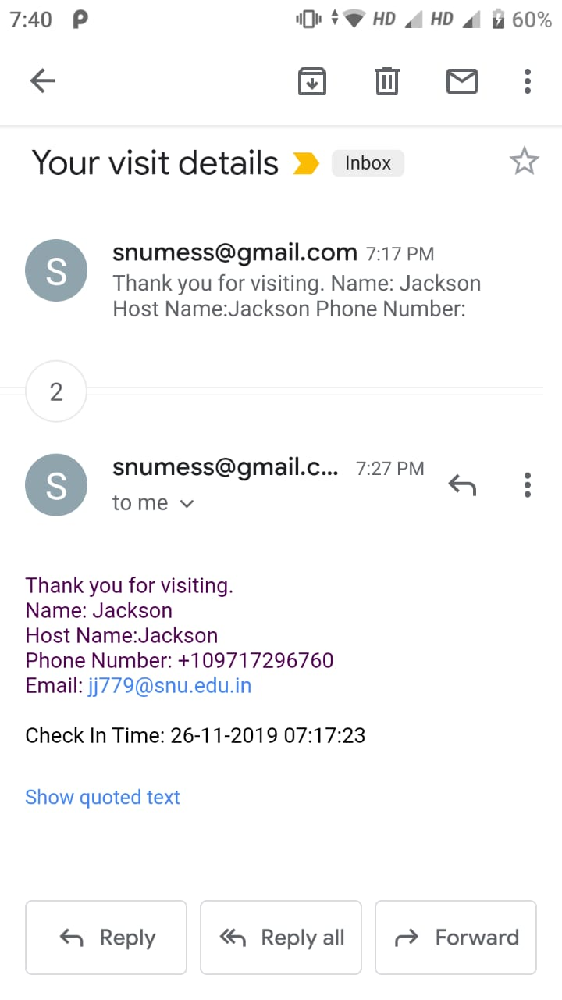
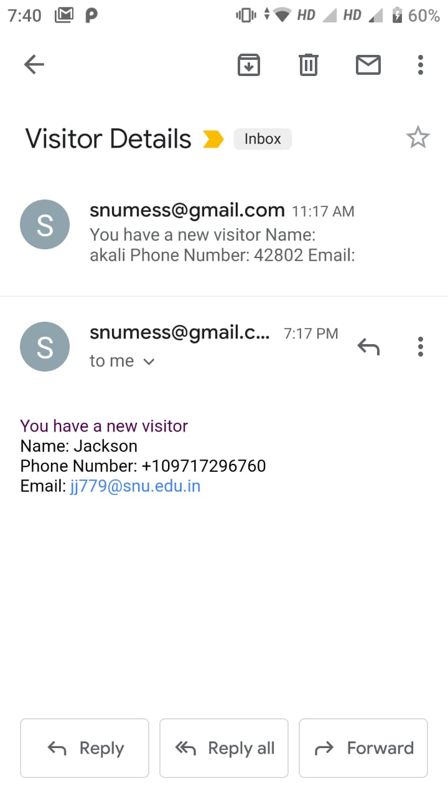

# InovaccerApp
Final app with all functionality. (Sending Mails and Sms)

On opening the app, the user would be presented with a screen with options to check out or check in.

If the user selects check in, then he\she is presented with this screen, first asking for host details.

Upon clicking submit, the user is taken to this screen, where he will have to enter his details.

