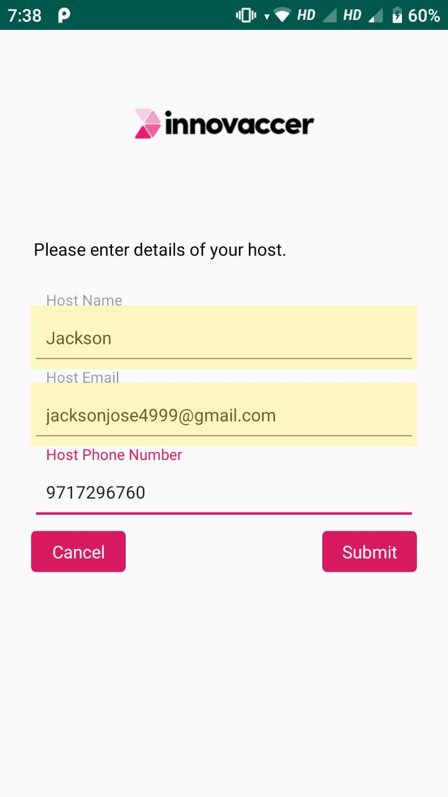

# Innovaccer SummerGeeks Internship Project

An android app, which serves as an entry management system, which let's visitors check-in, records their
details, and then sends a notification, both using Email, and SMS, to the Host, whose details would be 
provided by the user. 
Then during check-out, the details of the visit is sent to the visitor, using his details asked earlier.

# Technologies used

1. The android app is developed in Kotlin.
2. FirebaseFirestore Database is used to store details of visitors and hosts.
3. Twilio api is used to send SMS programmatically,

# Final UI/UX
Final app with all functionality (Sending Mails and Sms). Made with google material design schema in mind.

On opening the app, the user would be presented with a screen with options to check out or check in.

If the user selects check in, then he\she is presented with this screen, first asking for host details.

Upon clicking submit, the user is taken to this screen, where he will have to enter his details.
After clicking submit, his details are stored online, in firebaseFirestore. This is to facilitate 
check-in and check-out, from any device with this app.

An email and a sms is sent to the Host, about details of the visitor. Email is sent using Gmail smtp, 
and SMS is sent using Twilio api, to programmatically send SMS using their cloud service. So the device
in which this app runs will not need a cellular service, only internet service is required.

When the user wants to check out, he is presented with this screen, he needs to enter his details,
both phone number and name is used to verify.
Once he clicks on submit, we iterate through the firebase database, and find the details of this user,
and use it to send an email to him/her about the details of his visit.

The email sent to the visitor, about the details of his visit.

